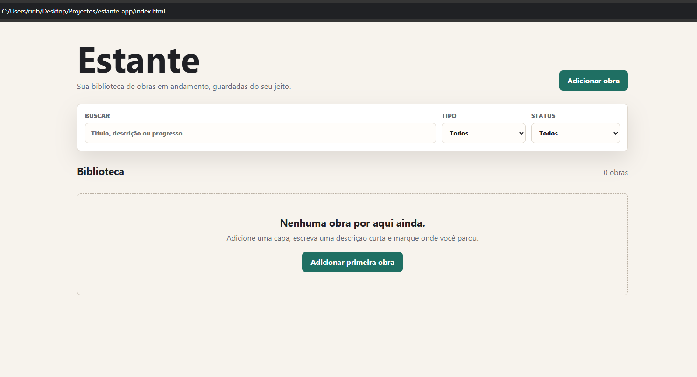

# Estante App

Estante App é um site simples para organizar obras como livros, mangás, filmes, séries, animes e jogos.  
O projeto permite cadastrar obras, adicionar capa, descrição, status e progresso.

<div align="center">  </div>


## Funcionalidades

- Cadastrar uma nova obra
- Editar uma obra existente
- Remover obra da biblioteca
- Adicionar imagem de capa
- Filtrar por tipo
- Filtrar por status
- Buscar por tí­tulo, descrição ou progresso
- Salvar os dados no navegador com `localStorage`

## Tecnologias

- HTML
- CSS
- TypeScript
- JavaScript gerado pelo TypeScript
- LocalStorage

## Estrutura Do Projeto

```text
estante-app/
  index.html
  styles.css
  app.ts
  dist/
    app.js
  package.json
  tsconfig.json
```

## Como Rodar

Abra o arquivo `index.html` no navegador.

Se você estiver usando uma extensão como Live Server no VS Code, também pode clicar com o botão direito no `index.html` e escolher:

```text
Open with Live Server
```

## Como Editar O Código

O arquivo principal para editar é:

```text
app.ts
```

Depois de alterar o `app.ts`, gere o JavaScript atualizado com:

```bash
npm run build
```

O TypeScript vai criar/atualizar:

```text
dist/app.js
```

O `index.html` usa esse arquivo:

```html
<script src="dist/app.js"></script>
```

## Modo Watch

Para compilar automaticamente enquanto edita:

```bash
npm run watch
```

Assim, sempre que você salvar o `app.ts`, o TypeScript tenta atualizar o `dist/app.js`.

## Scripts

```bash
npm run build
```

Compila o TypeScript uma vez.

```bash
npm run watch
```

Compila automaticamente enquanto você desenvolve.

## Dados Salvos

As obras são salvas no navegador usando `localStorage`, com a chave:

```text
estante-works-v1
```

Isso significa que os dados ficam salvos no navegador atual. Se você abrir em outro navegador ou limpar os dados do site, a biblioteca pode aparecer vazia.

## Tipos De Obra

O app suporta:

- Livro
- Mangás
- Filme
- Série
- Anime
- Jogo
- Outro

## Status

O app suporta:

- Quero ver/ler
- Em andamento
- Pausado
- Finalizado

## Objetivo Do Projeto

Este projeto foi criado para praticar:

- manipulação do domínio
- formulários
- listas
- filtros
- armazenamento local
- TypeScript
- organização de dados com tipos

## Próximas Melhorias Possíveis

- Criar tela de detalhes separada
- Adicionar favoritos
- Melhorar progresso por tipo de obra
- Criar coleçoes/listas personalizadas
- Melhorar responsividade mobile
- Adicionar exportação/importação de dados
- Migrar para React ou React Native futuramente